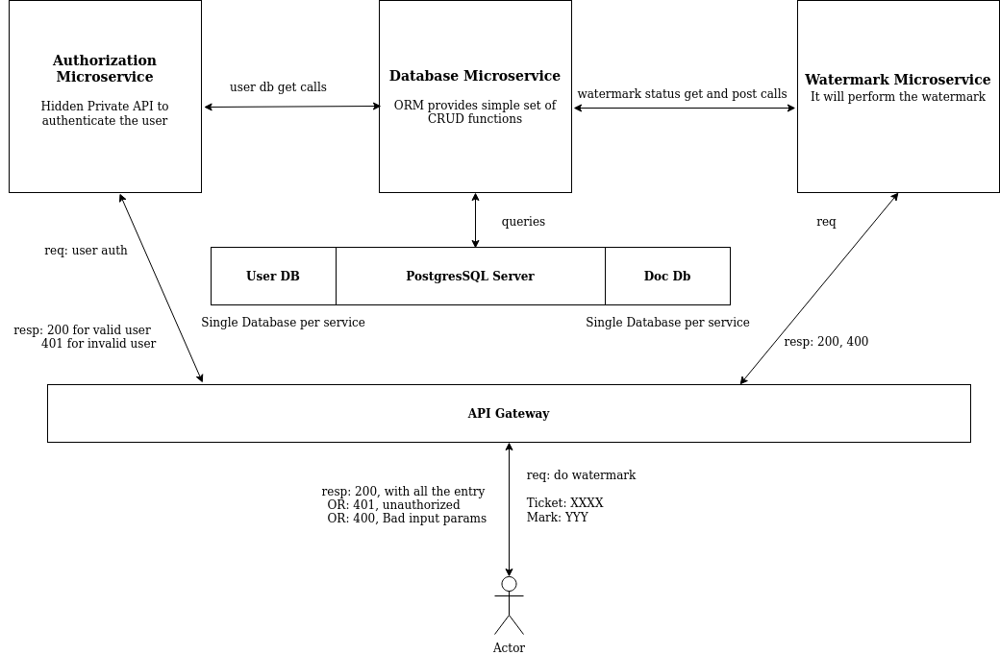

# Document Watermarking Service in Go

This is a simple web application written in Go that provides a service to watermark documents. The application is designed for a global publishing company that publishes books and journals. It allows specific users to watermark documents, which have a title, author, and a watermark property that can be in one of three states: Started, InProgress, and Finished.

## Problem Statement

The publishing company needs a reliable way to protect their intellectual property by adding a watermark to their documents. The watermarking process should be performed by authorized users, and once a document is watermarked, it can never be re-marked.

## Example Document

Here is an example of a document object:

```json
{
  "content": "book",
  "title": "The Dark Code",
  "author": "Bruce Wayne",
  "topic": "Science"
}
```

## Functionality

The Document Watermarking Service provides the following functionality:

- Allow specific set of users to watermark documents.
- Marking the document in one of three states: Started, InProgress, and Finished.
- Preventing re-marking of a document after it has been watermarked.

## Architecture

In this project, we will have 3 microservices: Authentication Service, Database Service and the Watermark Service. We have a PostgreSQL database server and an API-Gateway.



## Technologies Used

This application is built using the following technologies:

- Go
- Gin Web Framework
- MongoDB

## Getting Started

To use this application, you need to have Go and MongoDB installed on your machine. Follow these steps to get started:

1. Clone the repository to your local machine.
2. Navigate to the project directory and run `go mod download` to download the required packages.
3. Start the server by running `go run main.go`.
4. Open your web browser and go to `http://localhost:8080` to access the application.

## Conclusion

The Document Watermarking Service is a simple but effective solution for protecting the publishing company's intellectual property. It allows authorized users to watermark documents and ensures that once a document is watermarked, it can never be re-marked.
